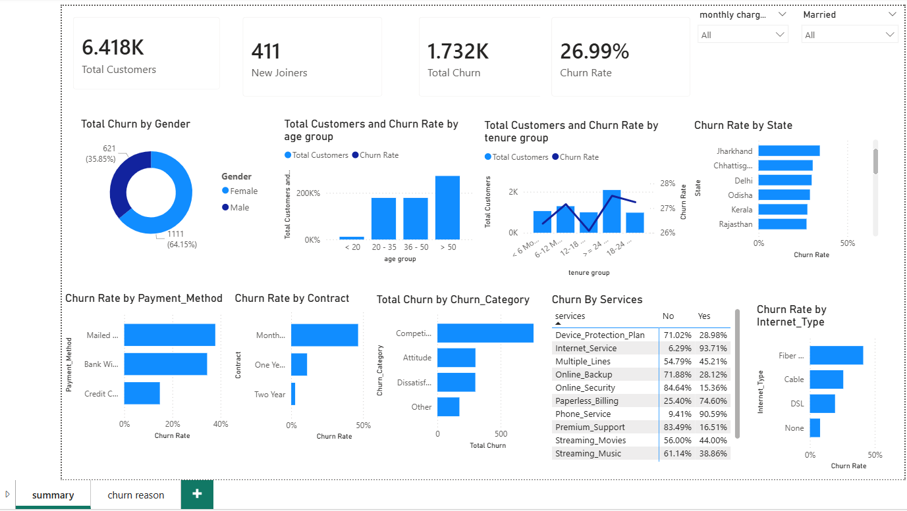

# 📊 End-to-End Customer Churn Analysis | MySQL + SQL + Power BI

## 📌 Overview

This project presents an end-to-end Customer Churn Analysis solution built using **MySQL** and **Power BI**. The objective is to identify the key drivers of customer churn, analyze customer behavior, and provide actionable insights that can help improve customer retention.

The project covers the complete analytics workflow—from SQL data cleaning and transformation to interactive dashboard development in Power BI using Power Query and DAX.

---

## 🎯 Business Problem

Customer churn directly impacts a company's revenue and profitability. Understanding why customers leave enables businesses to:

- Improve customer retention
- Reduce churn rate
- Increase customer lifetime value
- Design targeted retention strategies
- Make data-driven business decisions

---

---

## 🛠️ Tech Stack

- **MySQL**
- **SQL**
- **Power BI**
- **Power Query**
- **DAX**

---
